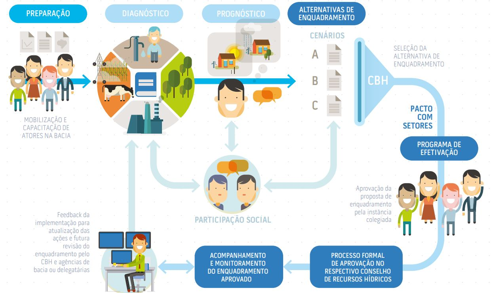

## O Enquadramento

<section style="text-align: left;">
<font size="5">

O enquadramento dos corpos de água em classes, segundo os usos preponderantes da água é um dos instrumentos da Política Nacional de Recursos Hídricos (PNRH), instituída pela Lei n° 9.433, de 8 de janeiro de 1997. O enquadramento visa:   

- assegurar às águas qualidade compatível com os usos mais exigentes a que forem destinadas; e
- diminuir os custos de combate à poluição das águas, mediante ações preventivas
permanentes.

<font size="5">Para mais informaçõe sobre o enquadramento acesse <https://www.snirh.gov.br/portal/snirh/centrais-de-conteudos/conjuntura-dos-recursos-hidricos/encarte_enquadramento_conjuntura2019.pdf>.</font>

</font>
</section>

## 

<font size="5"> Ou assista os vídeos abaixo </font>

```{r pressure, echo=FALSE, warning=FALSE}
library("vembedr")

embed_url("https://youtu.be/f2Yj9NYID9w?si=j-xvF8RsL4cHuxBl")

embed_url("https://youtu.be/Cfu7lINXSHc?si=axKLuyhbq4JnmlPW")

```


## Legislação Vigente

<section style="text-align: left;"> 
<font size="5">

As principais regulamentações para o enquadramento, no âmbito federal, são resoluções do CONAMA e do CNRH, citadas a seguir: 

- Resolução CONAMA nº 357, de 17/03/2005: dispõe sobre a classificação dos corpos de água e diretrizes para o seu enquadramento, bem como estabelece as condições e padrões de lançamento de efluentes;   

- Resolução CONAMA nº 396, de 03/04/2008: estabelece o enquadramento das águas subterrâneas;    

- Resolução CNRH nº 91, de 05/11/2008: estabelece os procedimentos gerais para o enquadramento dos corpos d’água superficiais e subterrâneos;    

- Resolução CNRH nº 141, de 14/07/2012: estabelece critérios e diretrizes para implementação dos instrumentos de outorga de direito de uso de recursos hídricos e de enquadramento dos corpos de água em classes, segundo os usos preponderantes da água, em rios intermitentes e efêmeros.    

</font>
</section>


## Conceito

<section style="text-align: center;"> 
<font size="6">

O enquadramento é um instrumento de planejamento, pois não se baseia apenas no estado atual de qualidade em um segmento do corpo d’água, mas estabelece a meta de qualidade de água a ser mantida ou alcançada no trecho para atender às necessidades estabelecidas pela sociedade, Com base nos usos pretendidos da água.  

</font>
</section>

###

<section style="text-align: left;"> 
<font size="5">

```{r, echo=FALSE, out.width="80%",  fig.align='center' }
knitr::include_graphics("piramide_horizontal.jpg")
```

As metas de qualidade são definidas para atender todos os usos da água nos trechos, niveladas pelo uso que demanda a melhor qualidade.

</font>
</section>

### 
<section style="text-align: center;"> 
<font size="5">

Para que a proposta de enquadramento seja adequada ao estabelecido na legislação, é necessário prever metas intermediárias e progressivas até que se alcance a meta final desejada. Assim, se pode prever metas para curto, médio e longo prazos.   

</font>
<font size="3">

```{r, echo=FALSE, out.width="65%", fig.cap="METAS INTERMEDIÁRIAS E PROGRESSIVAS UTILIZADAS NA PROPOSTA DE ENQUADRAMENTO",  fig.align='center' }
knitr::include_graphics("Metas.jpg")
```
</font>
</section>

###
<section style="text-align: center;"> 

<font size="4">

```{r, echo=FALSE, out.width="70%",  fig.align='center' }

```

A proposta de enquadramento deverá contemplar quatro etapas: i) diagnóstico; ii) prognóstico; iii) propostas de metas relativas às alternativas de enquadramento; e iv) programa para efetivação. Depois de aprovada no CBH, a proposta segue para a aprovação nos conselhos de recursos hídricos.

</font>
</section>


## Conjuntura do Enquadramento

###

<section style="text-align: center;"> 
<font size="3">

BACIAS INTERESTADUAIS COM ENQUADRAMENTO REALIZADOS SEGUNDO SISTEMAS DE CLASSIFICAÇÃO ANTERIORES AO VIGENTE

```{r, echo=FALSE, out.width="50%",  fig.align='center' }
knitr::include_graphics("enquadramento_federal.jpg")
```

</font>
</section>

### 
<section style="text-align: center;"> 
<font size="3">

BACIAS ESTADUAIS COM ENQUADRAMENTO REALIZADO SEGUNDO O SISTEMA DE CLASSIFICAÇÃO VIGENTE NA ÉPOCA DA EDIÇÃO DO ATO NORMATIVO   

</font>
<font size="3">

```{r, echo=FALSE, out.width="50%", fig.align='center' }
knitr::include_graphics("enquadramento_estadual.jpg")
```
</font>
</section>


## Desafios

<section style="text-align: center;"> 
<font size="5">

- **Lacunas de informação**: A elaboração de uma proposta de enquadramento demanda muita informação. Por exemplo, os cadastros de usuários dos bancos de dados dos órgãos gestores de recursos hídricos não fornecem todas as informações de usos da água na bacia, sendo necessário o levantamento de muitas informações complementares.
Na maioria dos casos, o monitoramento não é suficiente para a elaboração de um bom diagnóstico. Um bom diagnóstico depende de séries históricas que, por sua vez, depende de um bom monitoramento. Problemas de abrangência espacial do monitoramento. Necessidade de modelos de simulação da qualidade da água que dependem de dados. Modelos complexos e trabalhosos. 


</font>
</section>

###

<section style="text-align: left;"> 
<font size="5">

-  **Ausência de critérios para a definição dos usos “preponderantes” mais restritivos**: Fundamental para a definição das metas de qualidade. A legislação não define critérios ou uma hierarquia deles para se determinar qual uso da água é preponderante nos estudos de enquadramento. O termo preponderante pode se basear na vazão utilizada, na importância socioambiental ou econômica, por exemplo. A falta de critérios pode dificultar o consenso entre os atores e fragilizar o atendimento dos interesses coletivos. 


</font>
</section>

### 
<section style="text-align: center;"> 
<font size="5">

- **Parâmetros de qualidade de água prioritários de referência**: A Resolução CNRH nº 91/2008 traz em seu Art. 6º estabelece que propostas de metas deverão ser elaboradas em função de um conjunto de parâmetros de qualidade da água e das vazões de referência definidas para o processo de gestão de recursos hídricos e que estes parâmetros será definido em função dos usos pretensos da água, considerando os diagnósticos e prognósticos elaborados e deverá ser utilizado como base para as ações prioritárias de prevenção, controle e recuperação da qualidade das águas da bacia hidrográfica. 
Porém os usos, assim como as fontes poluidores, podem ser bastante diversos de um trecho para o outro e, em certos casos, conjuntos diferentes de parâmetros devam ser adotados para trechos específicos. Além disso, há questões relacionadas com a disponibilidade de dados do monitoramento.


</font>
</section>

###
<section style="text-align: center;"> 

<font size="5">

- **Monitoramento para acompanhamento das metas do enquadramento**: O Programa de Efetivação deve prever da revisão do desenho amostral da qualidade nos corpos de água, adequando a rede de monitoramento existente às necessidades do acompanhamento das metas do enquadramento. Isto provavelmente incluirá a expansão da abrangência espacial, considerando a vazão de referência e a frequência amostral adequada para este acompanhamento e possível uso dos dados para estudos de modelagem.
</font>
</section>


### 
<section style="text-align: center;"> 
<font size="5">

- **Participação dos atores da bacia**: É comum identificar forte assimetria de informação entre os atores durante o processo de enquadramento. Dada a complexidade do instrumento e a falta de definições mais claras, observa-se a adoção de interpretações e procedimentos bastante diversos em diferentes processos de enquadramento já realizados. Isto pode dificultar a aprovação nos CBHs e nos conselhos de recursos hídricos. Há ainda os obstáculos relacionados com a mobilização dos setores e atores carentes de recursos para a participação mais efetiva. Novas ferramentas de participação e a inclusão digital, no entanto, têm ajudado a superar tais obstáculos.

</font>
</section>


###
<section style="text-align: center;"> 

<font size="5">

- **Articulação**: É fundamental o estabelecimento de arranjos funcionais e duradouros de articulação envolvendo os usuários, entes integrantes do SINGREH nos níveis federal, estadual e municipal, com atuação na bacia hidrográfica.

</font>
</section>


## Acertos

<section style="text-align: left;"> 

- **Articulação, articulação e mais articulação**. As propostas de enquadramento aprovadas dependem de um enorme esforço de articulção entre os atores da bacia, setores usuários, órgão gestores e CBHs. 


</section>


###
<section style="text-align: left;"> 

- **Promover discussões técnicas e análises críticas sobre o instrumento** envolvendo os técnicos responsáveis pela sua implementação com o intuito de buscar o apefeiçoamento na construção das propostas e dos programas de efetivação.  

</section>


###
<section style="text-align: left;"> 

- **Inovação**:  Buscar novas formas de envolver os atores e aumentar a participação no processo de construção do enquadramento. Aplicar ferramentas de análise dos dados e modelagem da qualidade da água inovadoras nos rios e reservatórios para produzir estudos de enquadramento cada vez melhores.

</section>


###
<section style="text-align: left;"> 

- **Inovar sem inovar demais**: Ideias inovadoras tem seu espaço na elaboração de uma proposta de enquadramento. Porém, é necessário um certo conservadorismo de modo a seguir a legislação para que a proposta seja aprovada nos CBHs e conselhos e de modo a evitar a judicialização do processo.

</section>


## **Muito obrigado!**
<section style="text-align: center;"> 

marcelo.souza@ana.gov.br   
<font size="6">
Coordenação de Qualidade de Água e Enquadramento - CQUAL   
Superintendência de Estudos Hídricos e Socioeconômicos - SHE
</font>
</section>


